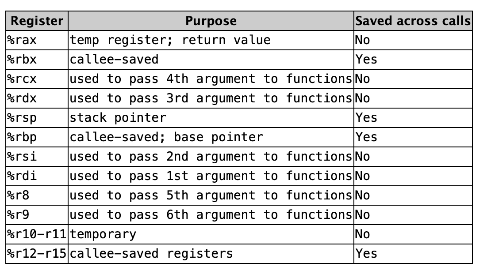

# libasm

The **libasm** project is an introduction to assembly language programming. The goal is to write a library of basic functions in **x86-64 assembly** and understand how low-level programming works. This project will challenge you to think differently about how code is executed at the hardware level and how high-level languages like C interact with assembly.

---

## Objectives

- Write a library of functions in x86-64 assembly.
- Learn the basics of assembly language, including registers, instructions, and memory management.
- Understand how to call assembly functions from C programs.
- Implement common functions like `strlen`, `strcpy`, `strcmp`, and more in assembly.
- Gain a deeper understanding of how low-level programming works.

---

## Requirements

- **NASM**: Netwide Assembler for compiling assembly code.
- **GCC**: GNU Compiler Collection for compiling C code.
- **Make**: For automating the build process.
- Basic knowledge of C programming and low-level concepts (registers, stack, etc.).

---

## Project Structure

The project consists of implementing a set of functions in assembly and creating a static library (`libasm.a`) that can be linked with C programs. The functions to implement are:

### Mandatory Functions

1. **ft_strlen**: Calculate the length of a string.
2. **ft_strcpy**: Copy a string from source to destination.
3. **ft_strcmp**: Compare two strings.
4. **ft_write**: Write to a file descriptor (similar to the `write` system call).
5. **ft_read**: Read from a file descriptor (similar to the `read` system call).
6. **ft_strdup**: Duplicate a string (similar to the `strdup` function).

### Bonus Functions (Optional)

1. **ft_atoi_base**: Convert a string to an integer with a given base.
2. **ft_list_push_front**: Add an element to the beginning of a linked list.
3. **ft_list_size**: Calculate the size of a linked list.
4. **ft_list_sort**: Sort a linked list.
5. **ft_list_remove_if**: Remove elements from a linked list based on a condition.

## Resources

[Calling convention](docs/calling_convention.pdf)
---

